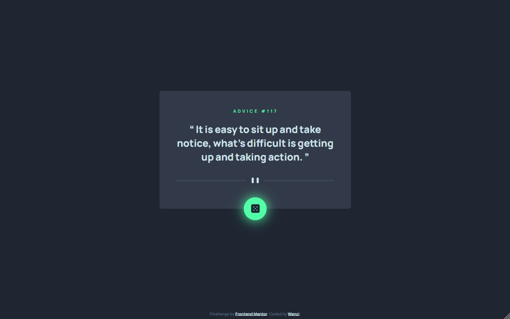

# Frontend Mentor - Advice generator app solution

This is a solution to the [Advice generator app challenge on Frontend Mentor](https://www.frontendmentor.io/challenges/advice-generator-app-QdUG-13db). Frontend Mentor challenges help you improve your coding skills by building realistic projects.

## Table of contents

- [Overview](#overview)
  - [The challenge](#the-challenge)
  - [Screenshot](#screenshot)
  - [Links](#links)
- [My process](#my-process)
  - [Built with](#built-with)
  - [What I learned](#what-i-learned)
  - [Continued development](#continued-development)
- [Author](#author)

## Overview

### The challenge

Users should be able to:

- View the optimal layout for the app depending on their device's screen size
- See hover states for all interactive elements on the page
- Generate a new piece of advice by clicking the dice icon

### Screenshot




### Links

- Solution URL: [Add solution URL here](https://your-solution-url.com)
- Live Site URL: [Add live site URL here](https://your-live-site-url.com)

## My process

### Built with

- Semantic HTML5 markup
- CSS custom properties
- Flexbox
- Mobile-first workflow
- [Advice Slip API](https://api.adviceslip.com)

### What I learned

- [Problem Summary](#problem solving)
  1.  [Two Types of English Double Quotes](#q1)
  2.  [How to Use APIs](#q2)
  3.  [Unable to Get New Responses in Firefox](#q3)

#### Problem Solving

##### Q1

Two types of english double quotes:

A: The two types are:

1. Straight Quotes: `""` (commonly used in programming environments)
2. Curly Quotes (also known as typographic quotes): `“”` (used in typesetting)

##### Q2

How to use APIs

A:

```js
async function fetchData() {
  const apiUrl = "https://api.adviceslip.com/advice";
  try {
    const response = await fetch(apiUrl, { cache: "no-store" });

    if (!response.ok) {
      throw new Error(`HTTP error! status: ${response.status}`);
    }

    const data = await response.json();
    const adviceId = document.querySelector(".advice-id");
    const adviceText = document.querySelector(".advice-text");

    adviceId.textContent = `advice #${data.slip.id}`;
    adviceText.textContent = `“${data.slip.advice}”`;
  } catch (error) {
    console.error("请求出错:", error);
  }
}
```

##### Q3

Unable to get new responses in Firefox:

A: Use `{ cache: "no-store" }` in the fetch request to ensure fresh responses.

```js
const response = await fetch(apiUrl, { cache: "no-store" });
```

### Continued development

There’s still much I need to learn about requests and responses. For example, I don’t understand why Chrome can fetch new requests but Firefox cannot.

## Author

- Frontend Mentor - [@ser-yeon](https://www.frontendmentor.io/profile/ser-yeon)
